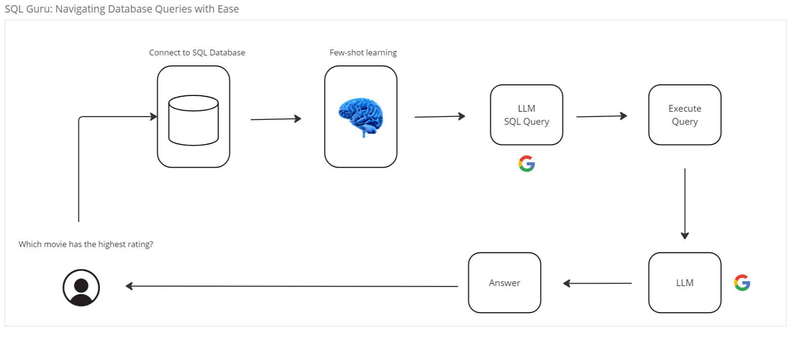

# RAG SQL Reader Application

This project is a Retrieval-Augmented Generation (RAG) application designed to streamline interactions with a SQL 
database. By harnessing the power of few-shot learning techniques, the application adapts 
a Large Language Model (LLM) to the specific database structure. Gemini-Pro, a language model from Google, is utilized for 
this purpose. The front end of the application is developed using Streamlit, providing an intuitive interface for users
to seamlessly interact with the database. 

# Features

- SQL Query Generation: The application is capable of generating SQL queries based on user input. Users can input their 
queries or questions, and the application utilizes the underlying LLM to generate corresponding SQL queries tailored
to the database schema.

- Few-Shot Learning: Few-shot learning techniques are employed to fine-tune the LLM for the specific database schema. 
By providing a small number of example-query pairs and leveraging the schema information, the LLM learns to generalize 
and generate accurate SQL queries for a wide range of user inputs.

- Schema Adaptation: The application dynamically adapts to changes in the database schema. By analyzing the schema 
structure, the LLM adjusts its query generation process to accommodate modifications or updates in the database schema, 
ensuring robust performance over time.

- Streamlit Interface: The front end of the application is developed using Streamlit, a user-friendly framework for 
building interactive web applications. The Streamlit interface provides users with an intuitive and responsive
platform to interact with the SQL database, facilitating seamless query formulation and data exploration.

# Database

The application utilizes a SQLite database containing information about movie ratings, earnings, and genres. 
You can find the database used in this project by downloading it from the following link: 
[Kaggle](https://www.kaggle.com/datasets/shahjhanalam/movie-data-analytics-dataset?select=movie.sqlite).

# Installation

To install the RAG SQL Reader application, follow these steps:

Clone the repository:

    git clone https://github.com/Eduardovasquezn/rag-sql-reader.git

Navigate to the project directory:

    cd rag-sql-reader

Create and activate virtual environment:

    python -m venv venv
    venv/Scripts/activate

Install the required Python libraries:

    pip install -r requirements.txt

# Usage 

Create a `.env` file using `.env-example` as a template:

    cp .env-example .env

In the `.env` file, insert your [Google API Key](https://aistudio.google.com/app/apikey):

    GOOGLE_API_KEY=your_google_api_key

Run the main application script:

    streamlit run src/app.py

